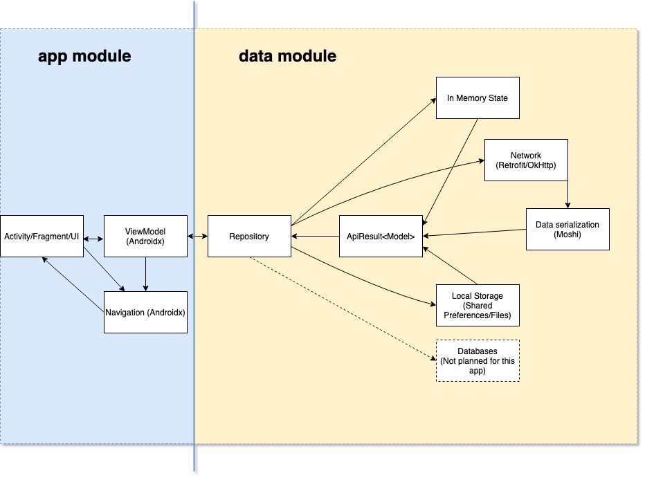

# Onboarding

## Summary
The point of this doc is to specifically help with new dev onboarding to learn project processes and 3rd party integrations.

## Target Audience
Dev team :)

## Introduction
All developers should read and familiarize themselves with the materials linked to from this page before starting work on the AcuPick Android app.

### SOLID
* Single Responsibility
    * Classes and functions should be concise and highly-focused.
* Open/closed Principle
    * Keep classes closed for modification, but open for extension.
* Liskov Substitution Principle
    * Subclasses should have parity with their superclasses (i.e. you should be able to substitute a superclass instance for a subclass and not have things break).
* Interface Segregation
    * Client/caller code should not know about functions/methods/properties that it doesn't use. Keep public-facing APIs highly-focused.
* Dependency Inversion
    * Avoid baking dependencies into classes. Instead, provide the ability for them to be injected, or passed in as a parameter, in the initializer.

### DRY
* Don't Repeat Yourself
* Extract common code into a shared helper method (possibly extension method) or class.
* Help identify and flag instances in the codebase where we can make these improvements.

### Asynchronous Operations
* We'll be using Coroutines + Flow to handle asynchronous operations. We will likely **NOT** be using RxJava as Flow should cover most use cases.

### Mobile Database
* Not needed at this point in time.

### UI
* Use ConstraintLayout where appropriate to keep your view hierarchy flat.
* Following Navigation Android Architecture Components, so single activity with fragment per screen.
* Use DataBinding for 99% of layouts.

### Don't re-invent the wheel
* Before developing anything complex, be absolutely sure that it's not already available for viable use from a reliable source.

## High Level Architecture Overview

### Summary
Each layer should only know about the layer directly below it and not necessarily the layer above it. Models would be the exception here since they would need be used in the ViewModel/Repository layers.

### Source
* Edit [this diagram](picker_app_high_level_architecture.xml) using https://www.draw.io. Export a new jpg (with shadows) and xml and overwrite the files in this repo when modifying the diagram.

## Development Environment
### IDE
* Latest stable Android Studio 4.x

### Language
* Kotlin
    * Aiming for 100% source written in Kotlin.
    * There should be a very good reason if any Java code is written for the app. Approval from the team lead required if the situation ever occurs.

### Min SDK
* 27

### Required Readings
* AndroidX (aka Jetpack/Architecture Components)
    * https://developer.android.com/topic/libraries/architecture
    * https://developer.android.com/topic/libraries/data-binding
    * https://developer.android.com/guide/navigation/navigation-getting-started
    * https://developer.android.com/topic/libraries/architecture/viewmodel
    * https://developer.android.com/topic/libraries/architecture/livedata
* Kotlin Docs 
    * https://kotlinlang.org/docs/reference/
    * Coroutines (see table of contents on page) - https://kotlinlang.org/docs/reference/coroutines/coroutines-guide.html
    * Flow - https://kotlinlang.org/docs/reference/coroutines/flow.html
* Koin
    * https://doc.insert-koin.io/#/
* Retrofit/OkHttp
    * https://square.github.io/retrofit/
    * https://square.github.io/okhttp/
* Groupie
    * https://github.com/lisawray/groupie
* Timber
    * https://github.com/JakeWharton/timber
* Unit Testing
    * Truth
        * https://truth.dev/
    * Mockito/Mockito-Kotlin
        * https://github.com/mockito/mockito-kotlin
        * https://site.mockito.org/

### Project dependency Overview
* Databinding
* Koin (DI solution used in the app)
* AAC Navigation (navigation pattern - 1 activity with multiple fragments)
* AAC ViewModel + LiveData (LiveData only at the ViewModel level)
* Coroutines + Flow (for async/streams)
* Retrofit + OkHttp + Moshi (REST Networking stack)
* Groupie (Complex screens with RecyclerView)
* Picasso (image management)
* Lottie (easy animations from creatives - unused at the moment)
* Java 8 DateTime (date/time)
* Firebase Crashlytics (crash reporting)
* Chucker (non-prod builds only - shows networking traffic in a notification for easy request/response viewing)
* LeakCanary (local dev builds only - detects/notifies of possible memory leaks)
* ProcessPhoenix (non-prod builds only - restart app due to changes made in dev options screen)